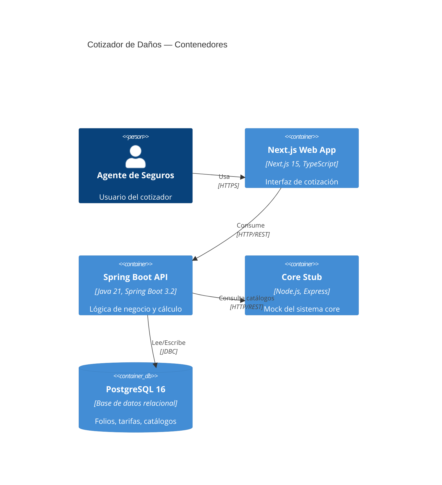

# Arquitectura del Sistema

## Índice

1. [Diagrama de contenedores (C4 nivel 2)](#1-diagrama-de-contenedores)
2. [Arquitectura del backend (Clean Architecture)](#2-arquitectura-del-backend)
3. [Arquitectura del frontend (Next.js App Router)](#3-arquitectura-del-frontend)
4. [Modelo de datos](#4-modelo-de-datos)
5. [Flujo de integración con core-stub](#5-flujo-de-integración-con-core-stub)

---

## 1. Diagrama de contenedores

> TODO: insertar diagrama Mermaid o imagen del sistema de contenedores

---

## 2. Arquitectura del backend

> TODO: describir las 4 capas con diagrama de paquetes y reglas de dependencia

### 2.1 Capa Domain
### 2.2 Capa Application
### 2.3 Capa Infrastructure
### 2.4 Capa Interfaces

---

## 3. Arquitectura del frontend

> TODO: describir estructura App Router, gestión de estado con Zustand, fetching con TanStack Query

### 3.1 Estructura de rutas
### 3.2 Gestión de estado
### 3.3 Capa de servicios

---

## 4. Modelo de datos

> TODO: diagrama ER de las tablas principales

### 4.1 Tabla `folios`
### 4.2 Tablas de catálogos y tarifas

---

## 5. Flujo de integración con core-stub

> TODO: describir qué datos se consultan al core, cuándo y con qué estrategia de resiliencia (Resilience4j)
