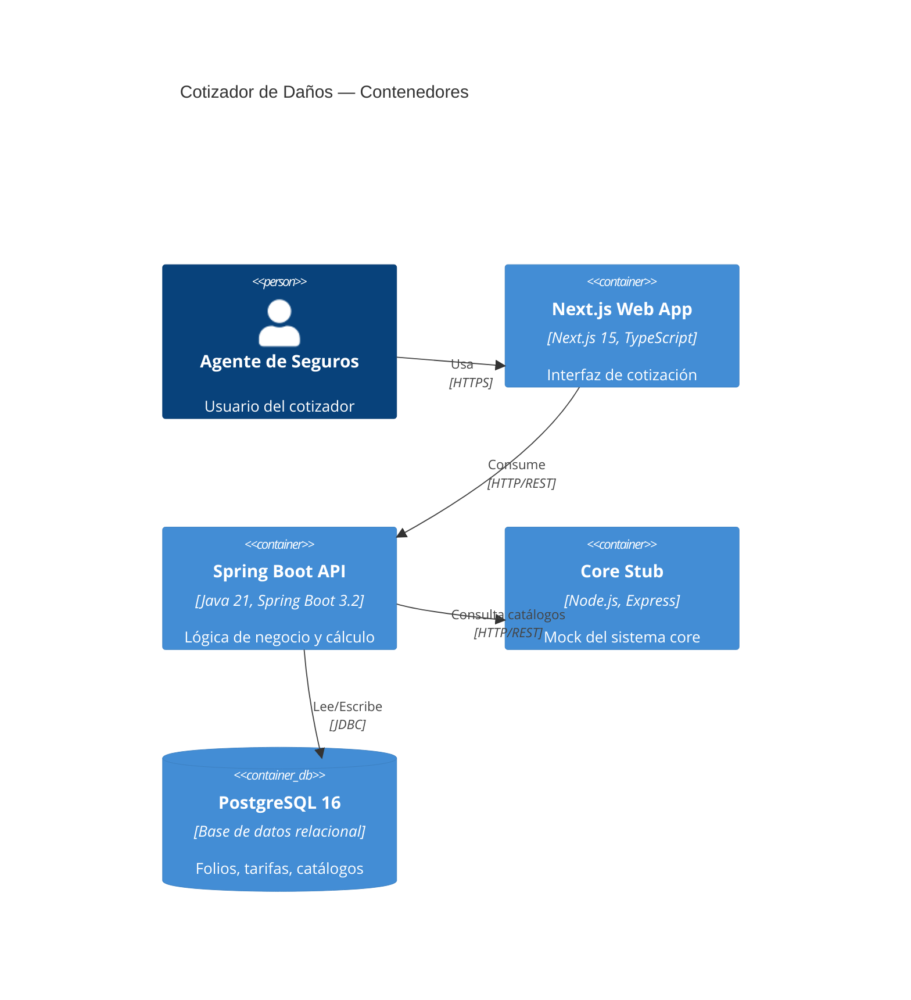

# Arquitectura del Sistema

## Índice

1. [Diagrama de contenedores (C4 nivel 2)](#1-diagrama-de-contenedores)
2. [Arquitectura del backend (Clean Architecture)](#2-arquitectura-del-backend)
3. [Arquitectura del frontend (Next.js App Router)](#3-arquitectura-del-frontend)
4. [Modelo de datos](#4-modelo-de-datos)
5. [Flujo de integración con core-stub](#5-flujo-de-integración-con-core-stub)

---

## 1. Diagrama de contenedores

> TODO: insertar diagrama Mermaid o imagen del sistema de contenedores

---

## 2. Arquitectura del backend

> TODO: describir las 4 capas con diagrama de paquetes y reglas de dependencia

### 2.1 Capa Domain
### 2.2 Capa Application
### 2.3 Capa Infrastructure
### 2.4 Capa Interfaces

---

## 3. Arquitectura del frontend

> TODO: describir estructura App Router, gestión de estado con Zustand, fetching con TanStack Query

### 3.1 Estructura de rutas
### 3.2 Gestión de estado
### 3.3 Capa de servicios

---

## 4. Modelo de datos

> TODO: diagrama ER de las tablas principales

### 4.1 Tabla `folios`
### 4.2 Tablas de catálogos y tarifas

---

## 5. Flujo de integración con core-stub

> TODO: describir qué datos se consultan al core, cuándo y con qué estrategia de resiliencia (Resilience4j)

---

## 6. Modelo de versionado optimista

El sistema mantiene dos agregados relacionados con versiones independientes: `Folio.version` y `Cotizacion.version`.

### 6.1 Folio.version

Incrementa en operaciones del **encabezado** de la cotización:

- Creación del folio (HU-001)
- Actualización de datos generales (HU-002)
- Configuración del layout de ubicaciones (HU-003)

### 6.2 Cotizacion.version

Incrementa en operaciones de **contenido** de la cotización:

- Registro y edición de ubicaciones (HU-004, HU-005)
- Configuración de opciones de cobertura (HU-006)
- Ejecución del cálculo (HU-007)

### 6.3 Justificación de la separación de agregados

Durante el diseño se evaluaron dos opciones:

**Opción A (implementada):** dos agregados DDD con ciclos de vida independientes. El `Folio` representa la identidad de la cotización (datos inmutables una vez establecidos) y la `Cotizacion` representa el estado operacional (alta frecuencia de cambio). Separarlos permite que ediciones masivas sobre ubicaciones no invaliden operaciones concurrentes sobre datos generales.

**Opción B (descartada):** agregado único con una sola `version`. Más simple conceptualmente, pero genera más conflictos de concurrencia: si un agente edita datos generales mientras otro edita una ubicación, ambos chocarían sobre la misma versión.

### 6.4 Contrato del header `If-Match`

Al editar una sección, el cliente debe enviar el `If-Match` correspondiente al agregado que está modificando:

| Endpoint | Agregado | `If-Match` usa |
|---|---|---|
| `GET /quotes/{f}/state` | Folio + Cotizacion | Retorna **ambas** versions |
| `PUT /quotes/{f}/general-info` | Folio | `Folio.version` |
| `GET /quotes/{f}/locations/layout` | Folio | — (solo lectura) |
| `PUT /quotes/{f}/locations/layout` | Folio | `Folio.version` |
| `PUT /quotes/{f}/locations` | Cotizacion | `Cotizacion.version` |
| `PATCH /quotes/{f}/locations/{i}` | Cotizacion | `Cotizacion.version` |
| `PUT /quotes/{f}/coverage-options` | Cotizacion | `Cotizacion.version` |
| `POST /quotes/{f}/calculate` | Cotizacion | `Cotizacion.version` |

### 6.5 Responsabilidad del frontend

El frontend (HU-F01 a HU-F06) debe consultar `GET /quotes/{f}/state` al iniciar cada pantalla para obtener la versión correcta antes de cualquier operación de escritura. El endpoint retorna `Folio.version` y `Cotizacion.version` en el body, lo que permite al cliente construir el header `If-Match` correcto según la sección que va a editar.
